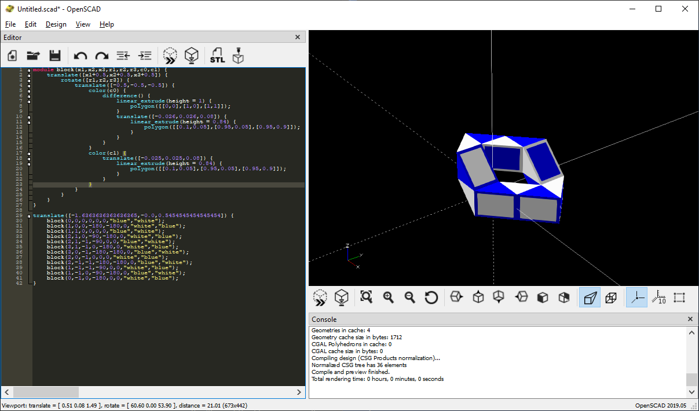

# snek
Rubik's Snake solution processor.

This script can:

1. Enumerate all solutions for Rubik's Snakes of a given length
2. Determine if a given solution is physically realizable
3. Visualize solutions using [OpenSCAD](https://www.openscad.org/)

---

# Dependencies

Requires python 3.6.x or greater and one additional library:

```ruby
$ pip install pyperclip
```

Optionally install [OpenSCAD](https://www.openscad.org/) if you would like to be able to use the `--draw` flag to visualize solutions.

If you would like to animate your visualizations, download  `ffmpeg` ([here](https://www.ffmpeg.org/)) or install `ImageMagick` ([here](https://imagemagick.org/script/download.php))

# Usage

See `python sneks.py --help` for full documentation:

```
$ python sneks.py
usage: sneks.py [-h] [--physical PHYSICAL] [--draw DRAW] [--solve SOLVE]
                [--cyclic] [--reverse] [--chiral] [--list] [--no-macro]
                [--copy]

Rubik's Mini Snake processor

optional arguments:
  -h, --help           show this help message and exit
  --physical PHYSICAL  Returns true if the given state is physically
                       realizable
  --draw DRAW          Prints OpenSCAD code to draw the given state
  --solve SOLVE        Counts the number of solutions for a Rubik's snake with
                       SOLVE number prisms
  --cyclic             Only return cyclic solutions and remove cyclic
                       duplicates
  --reverse            Remove duplicates under reverse symmetry
  --chiral             Remove duplicates under chiral symmetry
  --list               Makes --solve return all solutions instead of counting
  --no-macro           Exclude the macro definitions from --draw. Useful for
                       concatenating multiple states into 1 OpenSCAD file
  --copy               Makes --draw copy output to clipboard
```

Count all closed-loop (cyclic) solutions of the Rubik's Mini Snake (12 pieces) and remove duplicate solutions (under all symmetries):

```ruby
$ python sneks.py --solve 12 --cyclic --reverse --chiral
70
```

Or list them out instead:

```ruby
$ python sneks.py --solve 12 --cyclic --reverse --chiral --list
00002200002
00012300032
00101200303
00101230102
00120031002
00120113302
00120120013
00120120331
...
```

Check if a solution is physically realizable (does not self-intersect):

```ruby
$ python sneks.py --physical 00200200200
True
$ python sneks.py --physical 11111111111
True
$ python sneks.py --physical 00222000000
False
```

Or check if a solution is both cyclic and does not self-intersect:

```ruby
$ python sneks.py --physical 00200200200 --cyclic
True
$ python sneks.py --physical 11111111111 --cyclic
False
$ python sneks.py --physical 00222000000 --cyclic
False
```

Visualize solutions in 3D by generating OpenSCAD code:

```ruby
$ python sneks.py --draw 00101200303
module block(x1,x2,x3,r1,r2,r3,c0,c1) {
    translate([x1+0.5,x2+0.5,x3+0.5]) {
        rotate([r1,r2,r3]) {
            translate([-0.5,-0.5,-0.5]) {

                     ...

    block(1,-1,-1,-90,0,0,"white","blue");
    block(1,-1,0,-90,-180,0,"blue","white");
    block(0,-1,0,-180,0,0,"white","blue");
}

```

In lieu of `xclip` use `--copy` to copy OpenSCAD output to clipboard:

```ruby
$ python sneks.py --draw 00101200303 --copy
```

# Drawing solutions

Take the example above:

```ruby
$ python sneks.py --draw 00101200303
```

Copy and Paste the output into OpenSCAD to draw the solution:



Use *Preview* (F5) instead of *Render* (F6) to keep color information. Play with settings to enable Black background and remove axes.

# Animating solutions

In OpenSCAD, use the special `$t` variable that ranges from `0` to `1` to prepare to animate your figure. For example:

```ruby
rotate([0,0,360*$t])
```

Then animate via the menu:

1. `View`
2. `Animate`

The `FPS` value shows how many frames per second OpenSCAD will try to preview while animating. The `Steps` section shows how many total frames it will render. For example if `Steps = 10`, then `$t` will take on values `0, 0.1, 0.2, 0.3, ..., 1`.


Save your OpenSCAD code to a file. For example, `path/to/code.scad`. Then, click `Dump Pictures` checkbox and OpenSCAD will begin saving frames to disk in the same location that the code is saved to. You do not need to reset `$t` to zero, OpenSCAD will intelligently draw the frames in the correct order.